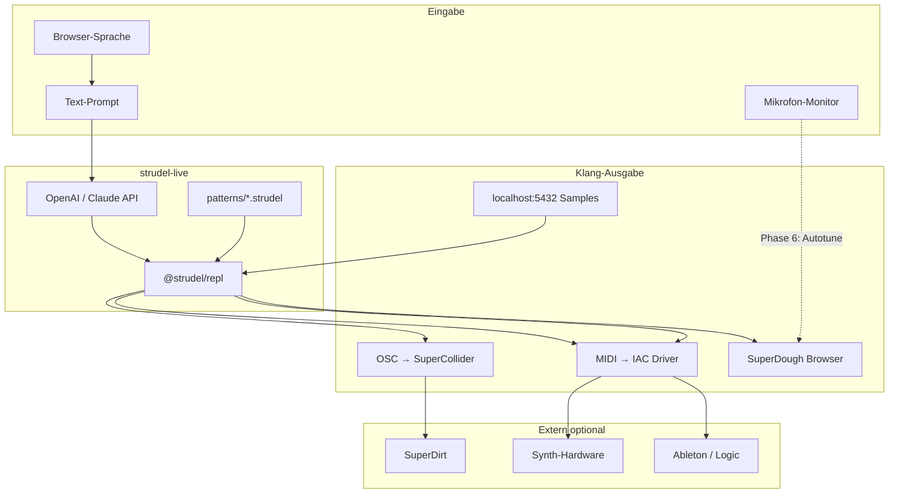

# System-Architektur

Wie **strudel-live** in ein größeres Setup passt — inspiriert von Switch Angel und der Algorave-Szene.

## Strudel ersetzt keine DAW

| | Ableton / Logic | Strudel |
|---|----------------|---------|
| Paradigma | Timeline, Clips, Automation mit Maus | Algorithmen, Patterns, Live-Code |
| Stärke | Mixing, Mastering, Songwriting | Generative Rhythmen, Polyrhythmen, mathematische Strukturen |
| Sound | Plugins, Audio-Recording | Browser-Synth (SuperDough) oder extern via MIDI/OSC |

**Profi-Workflow:** Strudel = Gehirn (Noten/Rhythmen live ändern), DAW/Synths = Klang (Serum, Analog Rytm, etc.).

## Schichten in diesem Projekt

## NPM-Skripte

| Befehl | Port | Zweck |
|--------|------|-------|
| `npm run dev` | 5173 | REPL + KI-Panel |
| `npm run samples` | 5432 | Eigene WAV/MP3 aus `samples/` |
| `npm run dev:full` | beide | Jam mit lokalen Samples |

## Repos & Links

- Dieses Repo: KI + Patterns + Docs
- [uzu/strudel](https://codeberg.org/uzu/strudel) — vollständiger upstream REPL
- [Strudel I/O](https://strudel.cc/learn/input-output/) — MIDI, OSC, MQTT
